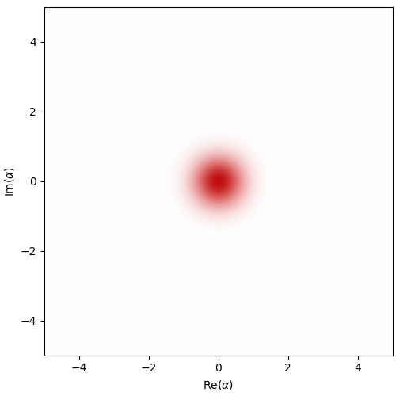

# Cat Qubit Simulation with Dynamiqs

This project explores cat qubit dynamics using Dynamiqs, an open-source framework that allows high-performance simulations of open quantum systems.
The work revisits materials from Alice & Bob's challenge at MIT iQuHACK 2025 and was completed independently after the event as a self-study exercise in modelling dissipative quantum systems.

   
  <em>Figure: Time evolution of the Wigner function showing dissipative stabilisation from the vacuum state into a cat state.</em>

## Overview
Cat qubits are an approach to superconducting qubits where, rather than shielding them from the environment, the aim is to engineer the system-environment coupling so that the qubit is dissipatively stabilised into a superposition of coherent states. They exhibit exponentially suppressed bit-flip errors, making them a promising architecture for fault-tolerant quantum computing by reducing the complexity of error correction.

This notebook explores their dissipative dynamics by simulating both the effective Hamiltonian model and the full circuit Hamiltonian of a single cat qubit in the rotated-displaced frame.

## Technical summary
- Modelled cat qubit dynamics under both the effective and full circuit-level Hamiltonians   
- Applied the rotated-displaced frame transformation to simplify system evolution  
- Simulated a continuous Zeno gate ($Z(\theta)$ rotation) and determined the optimal evolution time for a $\pi$-rotation under different single-photon loss rates.

## Attribution
This repository adapts starter code and problem descriptions from Alice & Bob's MIT iQuHACK 2025 Cat Qubit Challenge.  
